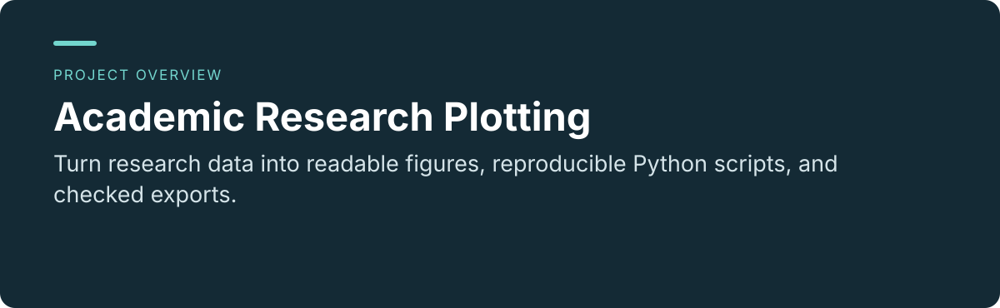
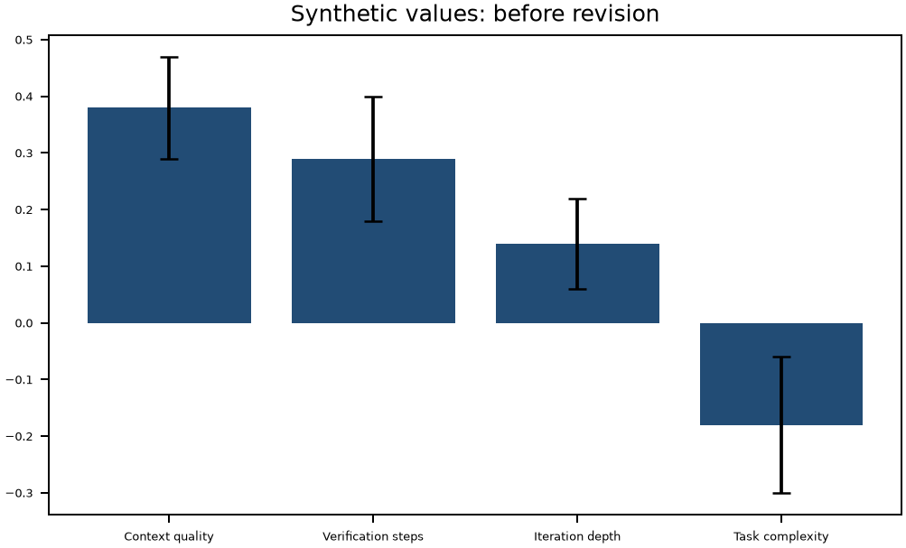
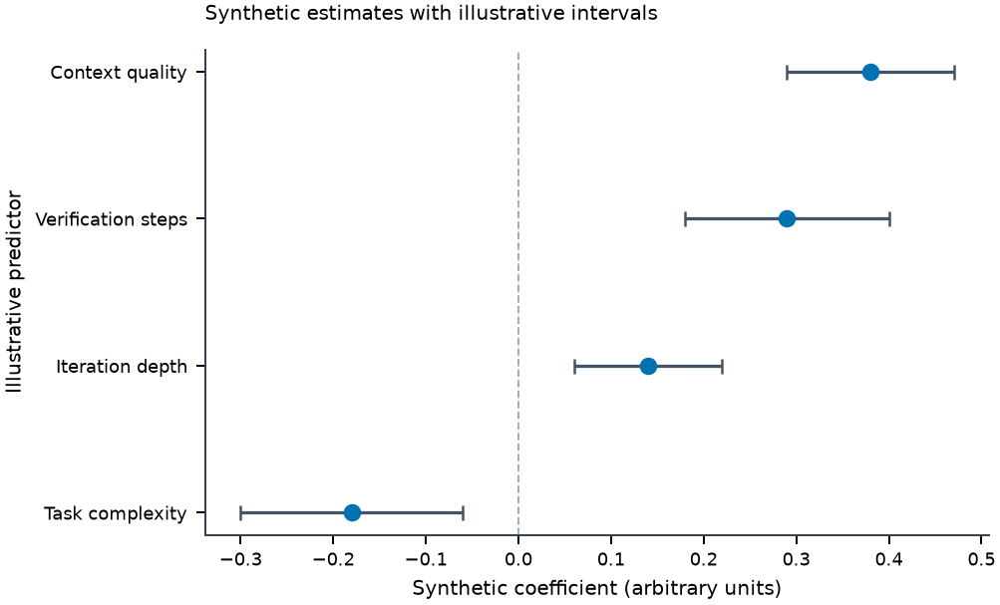
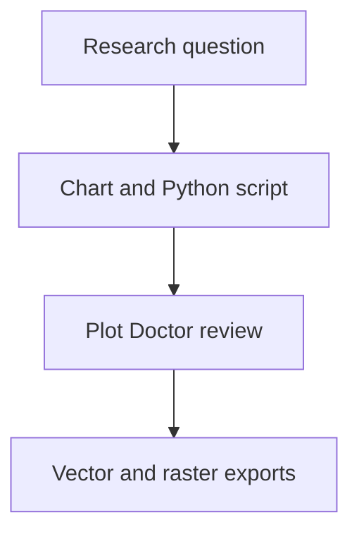

<p align="center"></p>

<p align="center"><a href="README.md"></a> <a href="README.zh-CN.md"></a></p>

# Academic Research Plotting

**Turn research data into readable figures, reproducible Python scripts, and checked exports.**

[Project usage and maintenance](../README.md) · [Report an issue](https://github.com/thejaytang/academic-research-plotting/issues)

## 1. What you can do

- Choose a chart for the research question, then improve labels, spacing and uncertainty display.
- Use the bundled Matplotlib style, Plot Doctor checks and PDF / SVG / PNG export helpers.

### Reproducible before and after

The same synthetic estimates and manually specified intervals, with improved encoding, labels and layout. These are not research findings.

**Before**



**After**



[Source](../examples/readme_demo.py) · [Actual audit output](../examples/readme-audit.txt)

## 2. Start here

Install the repository as a skill using the [project guide](../README.md#installation). Try the reproducible example from the repository root:

```bash
python3 -m venv .venv
# Activate .venv using your platform
python -m pip install matplotlib
python examples/readme_demo.py
```

## 3. Use cases

These are illustrative scenarios. Only explicitly linked execution artifacts represent checks performed for this update.

| Input or request | Expected result |
|---|---|
| A regression table | A coefficient plot with clearly labelled illustrative intervals and source code |
| An overcrowded figure | A revised layout and a list of remaining audit signals |



## 4. Requirements and current limits

The included example uses synthetic data. Python and Matplotlib are required for it. An agent host is needed for the full skill workflow. Plot Doctor is a heuristic aid: it does not validate statistics, source data or journal acceptance. Host and operating-system compatibility beyond the documented checks is unverified.

## 5. Documentation and sources

These links identify the implementation, operating instructions or related projects for a closer fit check.

- [Skill instructions](../SKILL.md)
- [Chart-selection guidance](../references/chart-selection.md)
- [Reproducible demonstration](../examples/readme_demo.py)

## 6. License and maintenance

See the root [LICENSE](../LICENSE) for terms and attribution. Third-party materials retain their own terms.

This is the public introduction. Linked project documents remain authoritative for operation, constraints and maintenance. Presentation updated: 2026-09-22.
