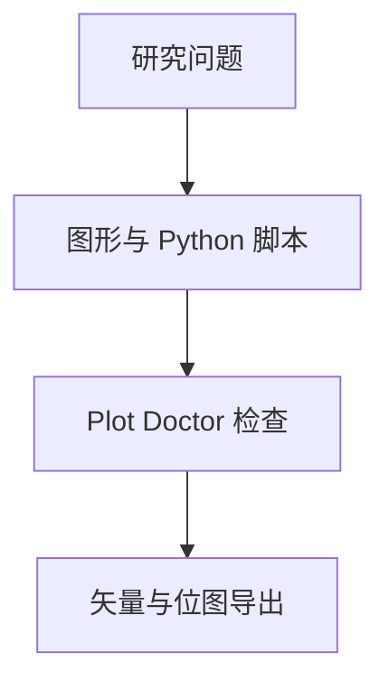

<p align="center"></p>

<p align="center"><a href="README.md"></a> <a href="README.zh-CN.md"></a></p>

# Academic Research Plotting

**把研究数据变成清晰图件、可复现的 Python 脚本和经过检查的导出文件。**

[项目使用与维护入口](../README.md) · [报告问题](https://github.com/thejaytang/academic-research-plotting/issues)

## 1. 能完成什么

- 先根据研究问题选择图形，再改善标签、间距和不确定性表达。
- 复用内置 Matplotlib 样式、Plot Doctor 检查及 PDF / SVG / PNG 导出工具。

### 可复现的前后对照

同一组合成估计值和人为设定区间；展示编码、标签和排版修改，不代表真实研究发现。

**修改前**


**修改后**


[源码](../examples/readme_demo.py) · [实际检查结果](../examples/readme-audit.txt)

## 2. 从这里开始

按[项目指南](../README.md#installation)安装技能。在仓库根目录运行可复现示例：

```bash
python3 -m venv .venv
# Activate .venv using your platform
python -m pip install matplotlib
python examples/readme_demo.py
```

## 3. 使用场景

以下为说明性场景；只有明确链接的运行产物才代表本次检查结果。

| 输入或请求 | 预期结果 |
|---|---|
| 回归表 | 带有明确区间标签的系数图及源码 |
| 拥挤的图件 | 调整后的版式及仍待检查的问题 |



## 4. 使用条件与当前边界

内置示例使用合成数据，运行需要 Python 和 Matplotlib；完整技能流程需要 Agent 宿主。Plot Doctor 是启发式辅助工具，不验证统计方法、原始数据或期刊接收结果。已记录检查以外的宿主与操作系统兼容性尚未验证。

## 5. 资料与来源

下面链接指向实现、操作说明或相关项目，便于进一步判断适用性。

- [技能指令](../SKILL.md)
- [图形选择说明](../references/chart-selection.md)
- [可复现示例](../examples/readme_demo.py)

## 6. 许可与维护

许可与归属以根目录 [LICENSE](../LICENSE) 为准；第三方材料保留其原有条款。

本页为对外介绍。具体操作、约束和维护说明以链接的项目文档为准。展示页更新：2026-09-22。
